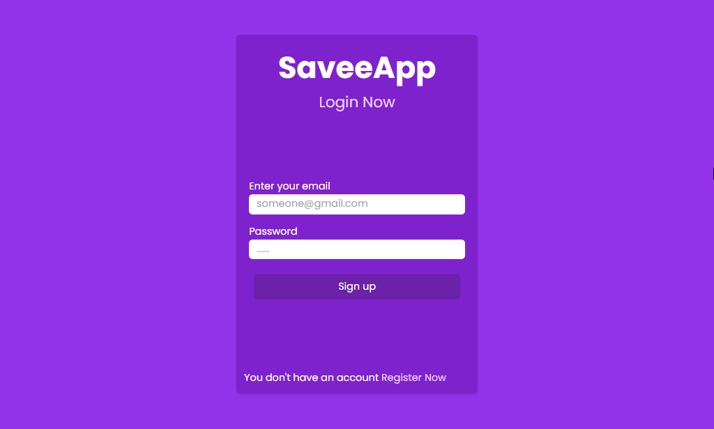

# React Firebase Chat App

## Introduction

This is a simple project built with React and Firebase. This project demonstrates the integration of React with Firebase for authentication, database, and hosting.

### Technologies Used: 
  - Frontend: React
  - Backend/Database: Firebase

### How to Run 
- Install the dependencies: `npm install`
- Start the development server: `npm run dev`
- Open your browser and visit: `http://localhost:3000`

## License

This project is licensed under the MIT License - see the [LICENSE](LICENSE) file for details.
